# A Comparison of Recommendation Models for Amazon's Movie and TV Catalog
#### by Charissa Ding, Carrie Yang, and Derek Zhao

The use of personalization has grown significantly to enhance the customer experience in various industries and has become especially indispensable in e-commerce. An online retailer that is able to make high quality recommendations for its customers is likely to sell more products and thus increase revenue and, by extension, profit. And if said retailer earns a reputation for providing accurate recommendations, it will be more effective at retaining customers and fostering trust about future recommendations, further increasing sales, revenue, and profit in the long run.

In this project, we survey the effectiveness of various traditional recommendation methods by testing their performance on varying-sized samples of the Amazon Movie and TV Reviews dataset.

#### Contents

- [Data](#data)
- [Evaluation Metrics](#evaluation-metrics)
- [Models](#models)
- [Methodology](#methodology)
- [Results](#results)
- [Concluding Remarks](#concluding-remarks)

## Data

#### Source and structure
The data used for this project comes from a collection of [Amazon Product Data](http://jmcauley.ucsd.edu/data/amazon/) maintained by Dr. Julian McAuley and the University of California at San Diego. The Movie and TV dataset from this collection contains reviews of films and TV series available for purchase in Amazon's catalog. Each review was written between **May 1996** and **July 2014** and contains the following relevent features:

- **reviewerID**: An alphanumeric string that uniquely identifies the user/author of the review.
- **asin**: The Amazon Standard Identification Number is a 10-character alphanumeric string that uniquely identifies a product within Amazon's catalog
- **rating**: An integer from 1 to 5, inclusive, that indicates the number of stars a user has rated for a particular item, with larger numbers corresponding to increased favorability.
Additional features such as the text of the review or the number of helpfulness votes of the review are also included in the dataset, however, traditional recommender system models are not suited for utilizing this data, so it is excluded from this project.

#### Summary
Amazon's Movie and TV Review dataset consists of **1.7 million** explicit ratings provided by **123,960** unique users for **50,052** unique items. The data has been pre-filtered so that all users have given at least 5 ratings and all items have received at least 5 ratings. Despite the pre-filtering, there are only 1.7 million available ratings for **6 billion** user-item pairs, resulting in a low density: **0.027%**. Such a high level of sparsity can be attributed to the fact that the dataset only contains ratings for those users who have written a review for an item and does not contain ratings for those users that only give star ratings. Thus, the density of the dataset is artificially low. In conjunction with the fact that such a low density presents challenges in generating suitable sample sets, the dataset is carefully re-filtered to produce a higher density using a procedure explained in greater detail later.

#### Exploratory Data Analysis
The distribution of ratings in the Amazon Movie and TV dataset is heavily skewed towards 5-star ratings. In fact, over half of the ratings are 5 stars, pulling the average rating up to **4.11** stars. Such an unbalanced distribution may prove challenging when trying to treat the data as a collection of explicit ratings, since the more dominant a single rating value becomes, the more the dataset resembles a collection of binary implicit ratings. Nonetheless, we proceed as planned, keeping in mind that binarizing the ratings remains an option for a future project.

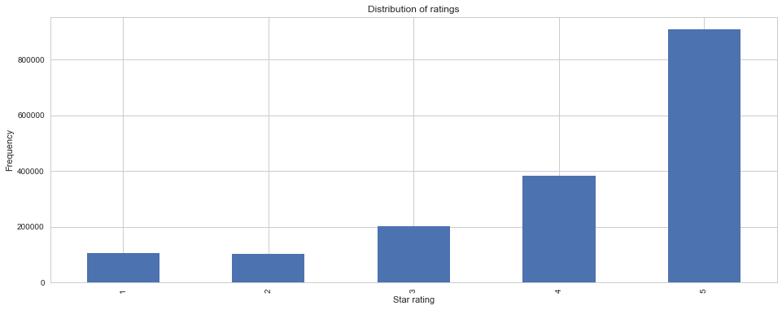

We also observe the typical long-tail distribution when calculating the number of reviews written by each reviewer: a small number of users are highly prolific while the vast majority of users write only a few reviews. In fact, the average and median number of reviews per user is **14** and **7**, respectively.

  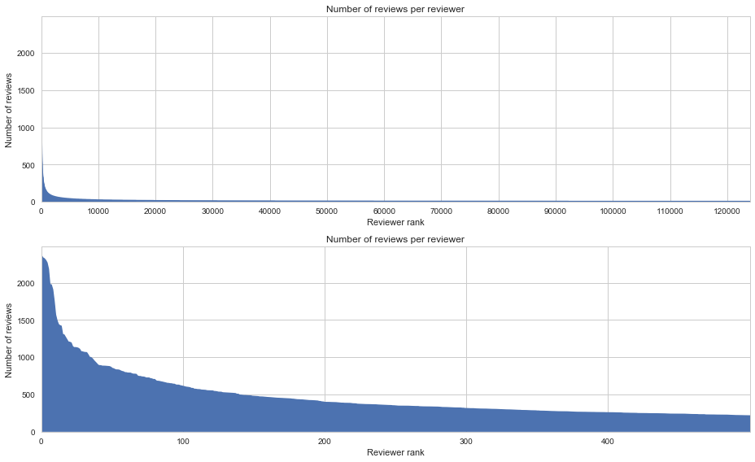
  Note: reviewer rank refers to the rank of the reviewer in terms of the number of reviews that reviewer has written.

The same pattern can be observed in the number of reviews per item. Because there are far fewer items than reviewers, we naturally expect that the median and average review count per item, **13** and **33.9** respectively, is higher than that per reviewer.

  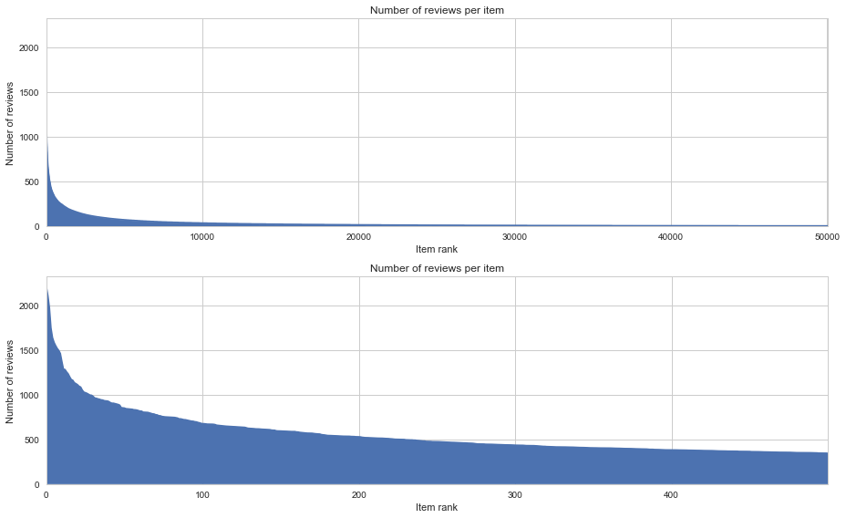
  Note: item rank refers to the rank of the item in terms of the number of reviews that item has received.

In addition, we observe that over **90%** of reviewers give average star ratings above a **3**. A typical reviewer rates items with an average of **4.2 stars**. Intuitively, this makes sense because people tend to only purchase items already like or believe they will like. It is also possible that the act of purchasing an item predisposes a customer to liking it.

Finally, it is worth mentioning the number of reviews per month is relatively stable from December 1999 to June 2012. On September 4, 2012, Amazon signed a deal with Epix to feature a much larger library of popular movies that may have contributed to the dramatic rise in monthly review volume.

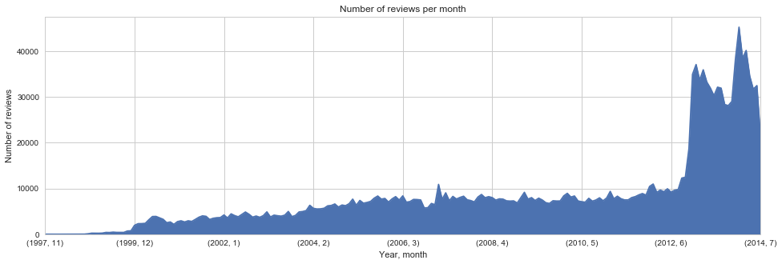

## Models
In the context of a recommendation problem, a predictive model is an algorithm capable of using existing user-item ratings, such as those already present in the dataset, to infer missing user-item ratings (i.e. how a user would rate an item they have not actully rated). For the problem of generating recommendations from the Amazon Movie and TV Reviews dataset, we consider 4 baseline models and 3 traditional models:

- **Averaging baseline**: The averaging baseline simply calculates the overall average of all ratings and uses this value as the prediction for all missing ratings. It is the crudest of all models.
- **Manual baseline**: The manual baseline is a more nuanced baseline where a predicted rating is calculated as the sum of the overall average, user bias, and item bias. A user's bias is manually calculated as the average of all ratings that a user has made subtracted from the overall average. Similarly, an item's bias is manually calculated as the average of all ratings that an item has received subtracted from the overall average.
- **Stochastic gradient descent (SGD) baseline**: The [SGD baseline](http://surprise.readthedocs.io/en/stable/basic_algorithms.html#surprise.prediction_algorithms.baseline_only.BaselineOnly) is one of two *learned* baseline models. It is the same as the manual baseline model, except rather than explicitly calculating values for each user and item bias, the user and item biases are parameters learned through optimizing an objective function using SGD.
- **Alternating least squares (ALS) baseline**: The [ALS baseline](http://surprise.readthedocs.io/en/stable/basic_algorithms.html#surprise.prediction_algorithms.baseline_only.BaselineOnly) is essentially the SGD baseline but with ALS replacing SGD as the method of optimization.
- **Unconstrained Matrix Factorization (SVD)**: Unconstrained matrix factorization, commonly but incorrectly known as [singular value decomposition](http://surprise.readthedocs.io/en/stable/matrix_factorization.html#surprise.prediction_algorithms.matrix_factorization.SVD), is a method wherein a full ratings matrix is approximated as the product of matrices of latent vectors, which are learned from the available ratings. Matrix factorization techniques are particularly well-suited for inferring missing ratings in a high sparsity ratings matrix.
- **Nonnegative Matrix Factorization (NMF)**: [NMF](http://surprise.readthedocs.io/en/stable/matrix_factorization.html#surprise.prediction_algorithms.matrix_factorization.NMF) is a variant of SVD with the constraint that all latent vectors may only contain positive values.
- **Item-based K-Neighbest Neighbors with Normalization**: [KNN](http://surprise.readthedocs.io/en/stable/knn_inspired.html#surprise.prediction_algorithms.knns.KNNWithZScore) is a predictive method where the inferred rating for a user-item pair is calculated as a linear combination of the ratings for the k most similar items that user has already rated. The weights in the linear combination are simply the normalized similarities between the target item and the rated items. We choose an item-based method since there are far fewer unique items than unique users, allowing for faster computation of item similarities compared to user similarities. Normalization is chosen to account for the fact that users and items can be biased in terms of their average ratings as well as have different degrees of ratings variance. Given that the Amazon ratings data suffers from a glut of 5-star ratings, it is important to consider that some users' ratings may skew positive with little variance, so normalizing these ratings may help the model perform better.

## Evaluation Metrics
Below we define the metrics used to evaluate the performance of each predictive model. In the context of an online retailer making purchase recommendations to its customers, the following four evaluation criteria are particularly relevant:

1. **Mean absolute error (MAE)**: MAE is the average of the absolute value of the difference between a predicted user-item rating and the actual user-item rating. It is a useful metric for understanding how close the typical predicted rating is from the actual rating.
2. **Precision**: Given a trained model, a specific user, and a set of test ratings that were not used to train the model, we can infer the rating for all items that user has rated in the test set and recommend the *k* items with the highest predicted ratings - this is the set of **recommended items**. Of the items the user has already rated in the test set, those items that the user rated 4 or 5 stars forms the set of **relevant items**. Precision, then, is number of recommended and relevant items divided by the number of recommended items. In other words, precision measures the proportion of relevant items in the set of items that are recommended to a customer. For an online retailer seeking to provide personalized recommendations to its customers, this metric is arguably more important than MAE since the retailer should be loathe to recommend items that a customer may not actually like.
3. **Catalog coverage**: Coverage is the number of items that are recommended at least once divided by the total number of items in the catalog. For an online retailer, maximizing catalog coverage is desirable as a larger variety of products can be surfaced through recommendation, thereby increasing the chances that a customer may discover a movie or TV show genuinely new and unexpected for them.
4. **Runtime**: An ideal predictive model is also one that can be trained without costing too much time. In order to keep a model fresh, it should be trained at regular intervals whenever new ratings data is collected. The faster the model is able to train, the more frequent these training intervals can be, and the fresher and more effective the model will be.

## Methodology
#### Data Sampling
In order to evaluate how the effectiveness of each model changes with varying amounts of ratings data, we sample the original dataset to produce sample sets of different sizes. Of particular importance is ensuring that these sample sets have as close to the same densities as possible so that the performance of a model in each sample set can be more readily compared. The creation of a sample set that controls for density can be achieved as follows:

1. Sample a specified proportion *p* of the original ratings data randomly.
2. Filter the sampled data so that all users have rated at least *k* movies and all movies have received at least *k* ratings.

By strategically choosing values of *p* and *k* while sampling, we create sample sets of different sizes but with densities as close as possible.

|Sample set|% Sampled before filtering (*p*)| *k* | Density | % Actually sampled|
|---|---|---|---|---|
|Ratings18|100|20|0.008|18|
|Ratings07|50|13|0.007|7|
|Ratings02|25|9|0.007|2|
|Ratings01|10|5|0.005|1|

#### Hyperparameter Search and Model Tuning
For hyperparameter searches, we eschew the traditional brute force method of grid searching for optimal hyperparameters and instead turn to a form of Bayesian optimization utilizing [tree-structured Parzen estimators (TPE)](http://steventhornton.ca/hyperparameter-tuning-with-hyperopt-in-python/). It has been show that Bayesian optimization is a more effective model tuning method than random search and that random search is a more effective model tuning method than grid search. Bayesian optimization works by iteratively making a guess about the optimal combination of hyperparameter values, testing that guess by evaluating a model with those hyperparameter values, and based on the model's performance, positing an updated guess. In this way, it is able to converge faster to optimal hyperparameter values than grid search or random search.

##### Unconstrained Matrix Factorization
Below are the results of a TPE search for optimal hyperparameter values of an SVD model.

|Hyperparameter|Description|Optimal Value|
|---|---|---|
|n_epochs|The number of cycles a dataset is utilized for model training prior to termination|28|
|n_factors|The number of latent factors used to factorize the ratings matrix|12|
|reg_all|The regularization parameter applied to all latent values to prevent overfitting|0.285|

Data from the full search is plotted below.

- The first plot of each row shows the hyperparameter value tested at each iteration. As TPE discovers which value is more effective, it narrows its search region, which is most evident for the **reg_all** hyperparameter.
- The second plot of each row shows the frequency with which a particular hyperparameter value is tested. TPE tends to sample more frequently from regions where model performance is better. 
- The third plot of each row shows the various loss values associated with a given hyperparameter value. The loss value is the average of 3-fold cross-validated MAE's achieved by the model using a given hyperparameter configuration.

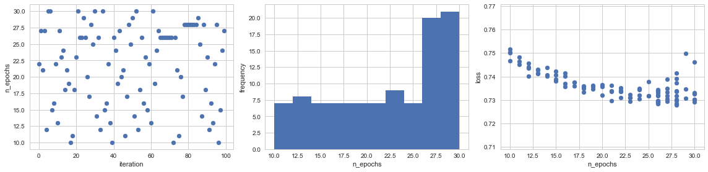
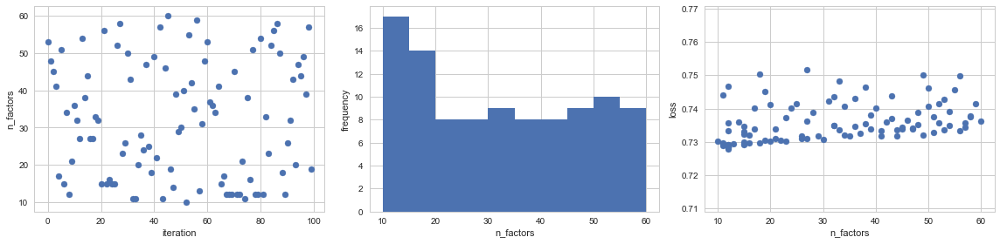
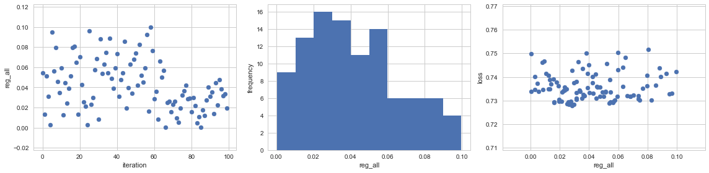

As expected, the longer a model is allowed to train for, the better its performance will be, however this only true up to a point (around 28 epochs). More surprising is the fact that values for the number of latent vectors correspond to improved MAE's. This is likely due to the fact that too many latent vectors will cause SVD to overfit the data.

##### Non-negative Matrix Factorization
Below are the results of a TPE search for optimal hyperparameter values of an NMF model.

|Hyperparameter|Description|Optimal Value|
|---|---|---|
|n_epochs|The number of cycles a dataset is utilized for model training prior to termination|26|
|n_factors|The number of latent factors used to factorize the ratings matrix|18|
|reg_bi|The regularization parameter applied to item bias values|0.0385|
|reg_bu|The regularization parameter applied to user bias values|0.0285|
|reg_pu|The regularization parameter applied to latent user vectors|0.018|
|reg_qi|The regularization parameter applied to latent item vectors|0.0841|

Data from the full search is plotted below.

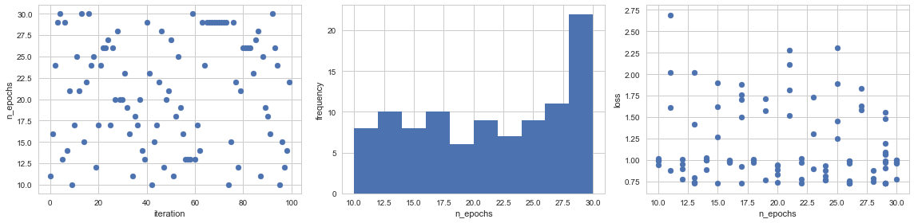
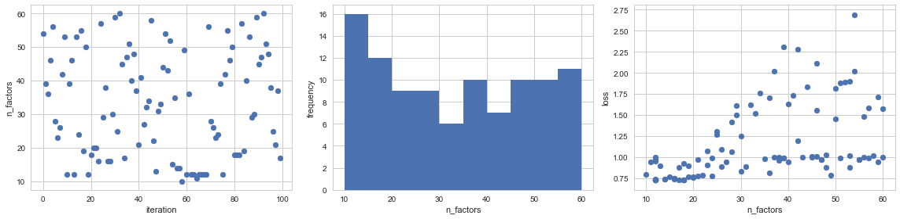
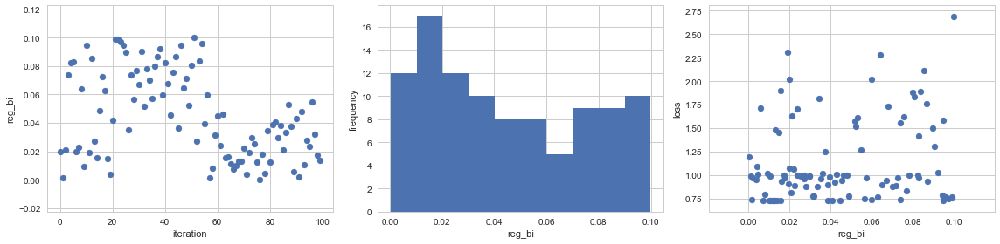

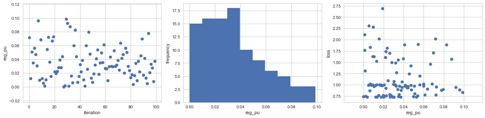

##### K-Nearest Neighbors with Normalization

Below are the results of a TPE search for optimal hyperparameter values of an item-based normalized KNN model.

|Hyperparameter|Description|Optimal Value|
|---|---|---|
|k|The maximum number of nearest item neighbors used to make a ratings prediction.|37|
|min_k|The minimum number of item neighbors needed to make a ratings prediction. Otherwise use average of all ratings for target item.|1|
|similarity|Similarity function. Alternatives: cosine, pearson's correlation|mean squared difference|

Data from the full search is plotted below. Surprisingly, the value for *k* appears not to have much bearing on the model's performance, but a *min_k* of 1 does. This means that even if data is sparse, it is better to use 1 item neighbor to predict a rating than use a generic average. Also significant is how using mean squared difference as opposed to Pearson's correlation or cosine similarity for the item similarity function seems to improve the model's accuracy.

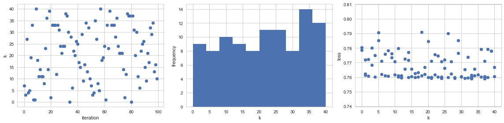
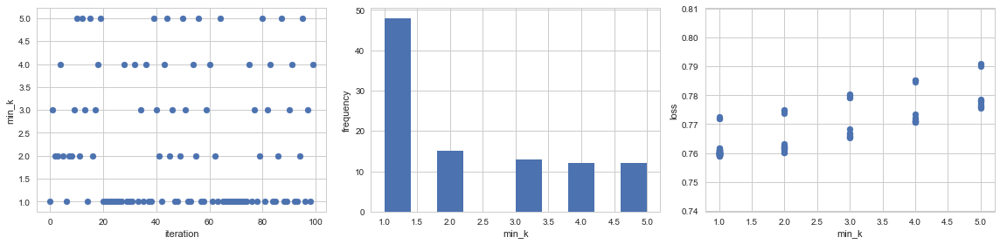
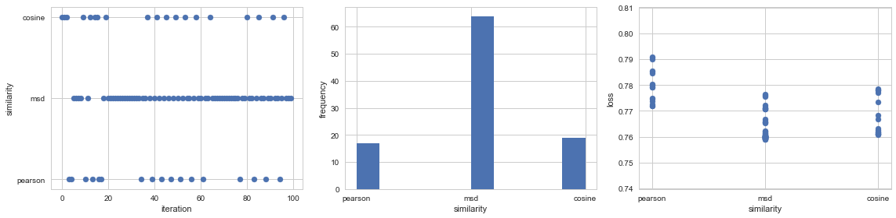
