# Readme

**Note**: This project was conducted in Jupyter notebooks running Python 3.6 kernels. All python packages installed on the team's environment and their corresponding versions are listed in **requirements.txt**.

For code and additional comments, please see the individual **.ipynb notebooks** and **lsh.py**.

# A Comparison of Recommendation Models for Amazon's Movie and TV Catalog - Part II
#### by Charissa Ding, Carrie Yang, and Derek Zhao

## Abstract

This portion of the project is an indirect extension of the previous work performed in [Part I](https://github.com/zhao1701/amazon-movie-recommendation/tree/master/part-01#a-comparison-of-recommendation-models-for-amazons-movie-and-tv-catalog). The premise for Part 2 remains largely the same: given a dataset from an online retailer describing how various users have rated various items, we seek to accurately infer how users will rate items they have not previously consumed in order to recommend products we believe a user would rate highly, thus constructing a personalized recommendation system that will increase revenue and customers' trust in the retailers' recommendations. Once again, we use data consisting of customers' explicit one-to-five-star ratings of Amazon's film and TV product catalog, the details and exploratory analysis of which were previously described in [Part I - Data](https://github.com/zhao1701/amazon-movie-recommendation/tree/master/part-01#data).

**Note**: For the remainder of this project, the term **ratings** will refer to these star ratings which are assigned on a whole number scale from 1 to 5 inclusive.

Whereas Part I explores the efficacy of a broad array of conventional recommendation models across datasets of varying sizes and evaluates model performance using numerous metrics, Part 2 focuses in-depth on optimizing the performance of a number of more modern techniques. To this end, for model comparison, we use only one sample of the dataset rather than many, and we evaluate the models on fewer metrics.

In exploring some of the less conventional recommendation algorithims and discovering how they may or may not help improve recommendation performance, we implement a number of models ourselves in order to better and more deeply understand how they function. In particular, we build a Locality Sensitive Hashing model with Cosine Similarity (CosineLSH), and a Probabilistic Latent Semantic Indexing (PLSI) model.

In addition, we also utilize the factoriztion machine model from the FastFM library, and experiment with a few different feature selection schemes, in search for a model with optimal performance. In the end, we find that, a factorization machine that takes the predictions from the LSH and ALS baseline model as features, combined with additional item features such as list of actors, directors, production studios, and box office, leads to the best performance.

#### Contents

- [Data Sampling](#data-sampling)
- [Evaluation Metrics and Objective](#evaluation-metrics-and-objective)
- [Models](#models)
- [Methodology](#methodology)
- [Results](#results)
- [Conclusion](#conclusion)

## Data Sampling

In Part I, in order to evaluate how the effectiveness of each model changes with varying amounts of ratings data, we sample the original dataset to produce sample sets of different sizes. The sample set names and data sampling methodology was [described previously](https://github.com/zhao1701/amazon-movie-recommendation/tree/master/part-01#data-sampling). Because Part 2 focuses on evaluating model performance on a fixed dataset, this portion of the project uses only data from the **Ratings18** sample set. It constitutes 18% of all ratings data for Amazon's film and TV catalog and specifically includes only items that have been reviewed at least 20 times and users that have given at least 20 reviews.

## Evaluation Metrics and Objective

Below we define the metrics used to evaluate the performance of each predictive model. In Part I, the evaluation metrics are chosen and defined presuming that a recommendation system functions as follows:

1. Given a user, the system uses a previously trained model to predict how that user will rate all items he has not yet rated.
2. All unrated items are ranked by their predicted ratings, and the top *k* items are recommended to the user.

The obvious benefits of such a system are that the items with the highest predicted ratings are most likely to be relevant to the user, and thus the quality of those top *k* predictions is presumed to be high. However, in Part I, we see that the tradeoff is a restricted subset of items are continually recommended to the users. This is disadvantageous for the retailer as a large proportion of items in its catalog are never recommended even once, and this is unfortunate for the customer who might tire of seeing the same recommendations repeatedly. Therefore, in Part 2, we consider an alternate system:

1. Given a user, the system uses a previously trained model to predict how that user will rate all items he has not yet rated.
2. Of the unrated items with predicted ratings of 4 stars of above (out of a maximum 5), *k* items are randomly recommended to the user.

While this system might be less precise in its recommendations, both the retailer and the user benefit from being exposed to a much wider variety of recommendations. In this context, the following criteria are particularly relevant:

1. **Mean absolute error (MAE)**: MAE is the average of the absolute value of the difference between a predicted user-item rating and the actual user-item rating. It is a useful metric for understanding how close the typical predicted rating is from the actual rating. This is the primary metric by which models are tuned and their accuracy/predictive power judged.
2. **Area Under the Receiver Operating Characterstic curve (AUC)**: The [ROC curve](https://en.wikipedia.org/wiki/Receiver_operating_characteristic#Area_under_the_curve) is used to illustrate the discriminative power of a binary classifier and its **AUC** score is a useful single number summary of said power. While the models used to predict ratings are regression models, the predicted ratings must be binarized before recommendations are made (recall ratings of 4 or above are considered relevant and ratings below 4 are considered not relevant). Thus, the quality of a model's rating predictions can also be judged by how useful those predictions are in discriminating between relevant and not relevant items.
3. **Catalog coverage**: Catalog coverage is the number of items that are recommended at least once divided by the total number of items in the catalog. For an online retailer, maximizing catalog coverage is desirable as a larger variety of products can be surfaced through recommendation, thereby increasing the chances that a customer may discover a movie or TV show genuinely new and unexpected.
4. **User coverage**: User coverage is the number of users to whom a recommendation of a predicted relevant item is made at least once. Hypothetically, if a system predicts no items are relevant for a user, the system can still recommend the top *k* items with the highest predicted ratings. However, it remains useful to know for what proportion of users such a backup method would need to be implemented.

## Models

In the context of a recommendation problem, a predictive model is an algorithm capable of using existing user-item ratings, such as those already present in the dataset, to infer missing user-item ratings (i.e. how a user would rate an item they have not actully rated). For the problem of generating recommendations from the Amazon Movie and TV Reviews dataset, we consider the following models.

1. **Probabilistic latent semantic indexing (PLSI)**: [PLSI](https://en.wikipedia.org/wiki/Probabilistic_latent_semantic_analysis) is a probabilistic method that models the probability of co-occurence between users and items. In the context of ratings and recommendations, a user-item pair is considered co-occurrent if the item is relevant to the user. Unlike the other 7 models, PLSI accepts as input and returns as output only binary implicit ratings. 
2. **Averaging baseline**: The averaging baseline simply calculates the overall average of all ratings in the training set and uses this value as the prediction for all missing ratings. It is the crudest of all models.
3. **Bias baseline**: In Part I, we see that the bias model trained using alternating least squares achieves the lowest MAE of the models tested. We include this model as a benchmark. Bias parameters are learned for each user and each item, and a user-item rating is modeled as the sum of the mean rating, the user bias, and the item bias.
4. **Item-based collaborative filtering with cosine-based locality sensitive hashing (LSH)**: [Item-based collaborative filtering](https://en.wikipedia.org/wiki/Item-item_collaborative_filtering) is a predictive method where the inferred rating for a user-item pair is calculated as a linear combination of the ratings for the most similar items that user has already rated. The question of deciding which items are most similar to another can be addressed using [cosine-based LSH](https://stackoverflow.com/questions/12952729/how-to-understand-locality-sensitive-hashing) to determine approximate nearest neighbors.
5. **Factorization machine (FM)**: [FM's](https://getstream.io/blog/factorization-recommendation-systems/) model interactions between features through using factorized parameters. They are extremely effective on sparse data and provide a convenient means of including additional features into the dataset beyond the standard (user, item, rating) tuple. We test three FM models, each with different variations in feature engineering.
6. **Ensemble with gradient boosted trees (GBT)**: As the various previously mentioned models are expected to have different strengths and weaknesses in their ability to predict ratings, we use a standard ensembling technique of using their outputs as inputs into a [gradient tree boosting ](https://en.wikipedia.org/wiki/Gradient_boosting) model for improved performance.

## Methodology
#### Data Splits
The **Ratings18** sample set consists of 441,878 ratings for 7363 items from 7508 users. Because FM's allow for the incorporation of extra features, additional information can be scraped from various sources described later. However, because this additional data is not available for a subset of 600 items, 30,000 ratings for these items are excluded. This results in a dataset of 414,452 ratings for 6765 items from 7508 users.

This dataset is then shuffled and split 80%-10%-10% into a training set, cross-validation set, and test set. The ratio of the split may seem unusual given that more traditional splits allocate more data to the cross-validation and training sets. However, with over 4 million total ratings, we believe over 40,000 ratings provides enough data for cross-validation and testing to be just as effective.

#### Hyperparameter Search and Model Tuning
For hyperparameter searches, we eschew the traditional brute force method of grid searching for optimal hyperparameters and instead turn to a form of Bayesian optimization utilizing [tree-structured Parzen estimators (TPE)](http://steventhornton.ca/hyperparameter-tuning-with-hyperopt-in-python/). It has been show that Bayesian optimization is a more effective model tuning method than random search and that random search is a more effective model tuning method than grid search. Bayesian optimization works by iteratively making a guess about the optimal combination of hyperparameter values, testing that guess by evaluating a model with those hyperparameter values, and based on the model's performance, positing an updated guess. In this way, it is able to converge faster to optimal hyperparameter values than grid search or random search. For each hyperparameter search in this project 100 evaluations are made in which a model is fit on a training set, its performance is measured as its MAE on the cross-validation set, and an updated hyperparameter setting is computed for the next evaluation.

#### Probabilistic Latent Semantic Indexing
PLSI models the co-occurence of users and items by introducing latent factors representing concepts akin to user communities and item genres. Intuitively, if a user is modeled as having a high probability of belonging to a certain genre/community/latent factor, then all items modeled as having a high probability of belonging to that same genre/community/latent factor have a high probability of co-occuring with that user (i.e. it is likely that user would have rated those items 4 or above). 

Ratings data is binarized such that each rating of 4 or above represents a co-occurence for that user-item pair. The binarized ratings, along with user and item information, serve as the data upon which the PLSI model learns. The PLSI model is capable of two predictions:

1. The conditional probability that a specific item is rated 4 or above given the user is known.
2. The joint probability that a user-item pair has a rating of 4 or above.

The first type prediction is most useful for making top *k* recommendations, as the conditional probabilities for all items given a user can be ranked. However, for the purposes of binary classification, we use the second type of prediction, presuming that a threshold can be found such that most probabilities above said threshold represent ratings of 4 or above and most ratings below said threshold represent ratings below 4.

We use [our own implementation of the PLSI algorithm](https://github.com/zhao1701/amazon-movie-recommendation/blob/master/part-02/03%20-%20Probabilistic%20Latent%20Semantic%20Indexing.ipynb), optimizing latent factor parameters using [expectation maximization (EM)](https://en.wikipedia.org/wiki/Expectation%E2%80%93maximization_algorithm). The EM algorithm's main benefit is that it is highly parallelizable, which given the computing resources available for this project, we could not capitalize on. Unfortunately, without parallelization, the EM algorithm is impractically slow to converge. Nevertheless, we perform a basic hyperparameter grid search to assess the performance of PLSI.

Specifically, the only two hyperparameters we implemented are:

1. **n_factors**: The number of latent factors used to model co-occurences.
2. **n_iterations**: The number of times the EM algorithm is called to update latent factor parameters.

As the PLSI model's output is a series of probabilities, it is not a regression model. Thus, we use the AUC score to assess the model's performance. The heatmap below shows that while 30 latent factors and a high number of iterations is optimal, the AUC score is only a quite poor 0.6. Even though the PLSI model performs well on the most basic of test cases, Amazon's ratings data may be too noisy for a basic PLSI implementation to succeed, so further exploration is discontinued.

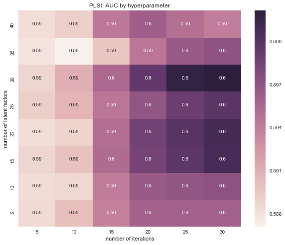

#### Item-based Collaborative Filtering with Cosine-based Locality Sensitive Hashing

In item-based collaborative filtering, a predicted rating for a user-item pair is calculated as a linear combination of the ratings for the most similar items that user has already rated. However, calculating and ranking pairwise similarities amongst all items can become impractical given a dataset of sufficiently large size. One solution is to determine the approximate nearest neighbors of each item and use only these neighbors (or a subset) when predicting a rating for a user-item pair.

Because each item can be represented as a vector of explicit ratings from various users, the similarity of two items can be measured using cosine similarity. Cosine-based LSH is a hashing technique wherein the probability that two item-vectors are hashed to the same key is proportional to their cosine similarity. If a hash-signature is built with multiple keys, then only those items that are highly similar will have the same signature. If multiple signatures are created per item, and two items are considered neighbors if at least one of those signatures is the same, then items that are somewhat similar still have some probability of being considered neighbors.

Once approximate nearest neighbors are calculated for all items, for each unrated item of a particular user, we can use that item's nearest neighbors that the user has rated to infer a predicted rating:

where *u* is the user, *i* is the item for which a rating is to be predicted, and *sim* is the cosine similarity of two items based on the ratings given from users that have rated both items. 

[Our implementation of item-based CF with cosine LSH](https://github.com/zhao1701/amazon-movie-recommendation/blob/master/part-02/04%20-%20Item-based%20Collaborative%20Filtering%20with%20Cosine%20LSH.ipynb) has two hyperparameters: **p** and **q**. Their descriptions and optimal values, found through a TPE hyperparameter search, are displayed below.

|Hyperparameter|Description|Optimal Value|
|---|---|---|
|p|The number of keys per signature|3|
|q|The number of signatures per item|25|

Data from the full search is plotted below.

- The first plot of each row shows the hyperparameter value tested at each iteration. As TPE discovers which value is more effective, it narrows its search region, which is more evident in later hyperparameters.
- The second plot of each row shows the frequency with which a particular hyperparameter value is tested. TPE tends to sample more frequently from regions where model performance is better. 
- The third plot of each row shows the various loss values associated with a given hyperparameter value. The loss value is MAE of the model's predictions on the cross-validation set using a given hyperparameter configuration.

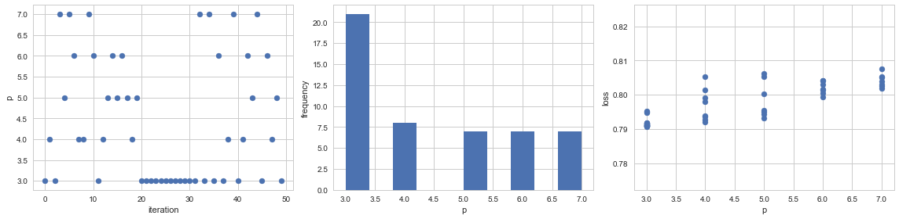
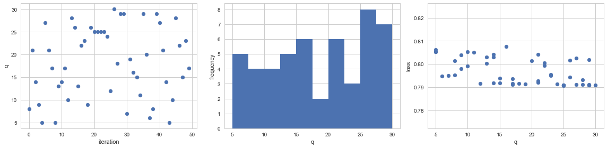

The optimal hyperparameter values are unsurprising: lower values for **p** decrease the number of neighborhoods while increasing their size (reducing the approximation aspect of approximate nearest neighbors at the expense of calculating more similarities) while higher values of **q** have the same effect.

#### Bias Baseline
The bias baseline is a learned baseline model that calculates a predicted rating using the following formula:

    predicted rating = overall average rating + user bias + item bias

Instead of explicitly calculating values for each user and item bias, the model treats user and item biases as parameters to be learned through optimizing an objective function, with alternating least squares (ALS) as the chosen method of optimization for its fast convergence.

Below are the results of a TPE search for optimal hyperparameter values of the bias model.

|Hyperparameter|Description|Optimal Value|
|---|---|---|
|n_epochs|Number of times parameters are updated through ALS|6|
|reg_i|L2 penalty weight for item bias.|0|
|reg_u|L2 penalty weight for user bias.|0|

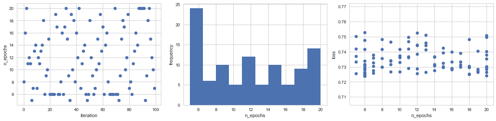
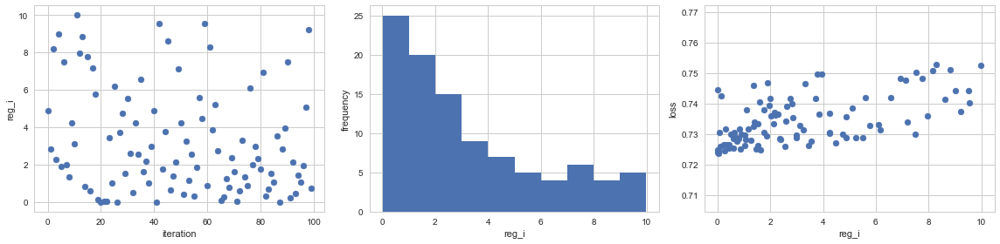
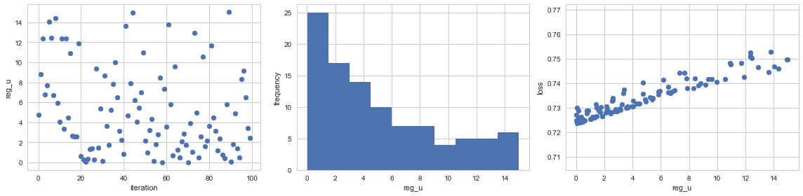

#### Factorization Machine with Only Ratings Data
As noted previously, FM's model interactions between features using factorized parameters. Although FM's are especially useful for incorporating external data as features, we first build an FM model that considers only user, item, and ratings data.

Below are the results of a TPE search for optimal hyperparameter values of this FM model.

|Hyperparameter|Description|Optimal Value|
|---|---|---|
|init_stdev|The standard deviation of initialized parameters|0.765|
|l2_reg_V|L2 penalty weight for pairwise coefficients|7.079|
|l2_reg_w|L2 penalty weight for linear coefficients|0.861|
|n_iter|Number of ALS parameter updates|929|
|rank|The rank of the factorization used for the second order interactions|2|

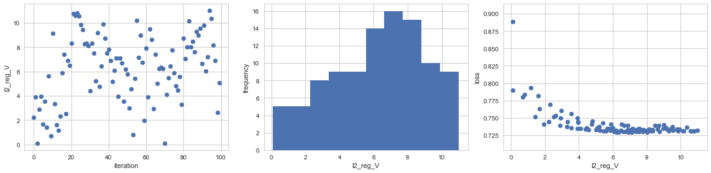
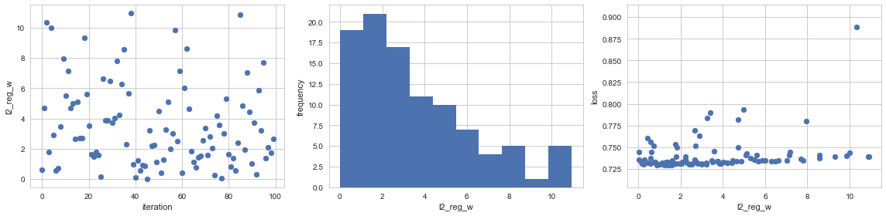
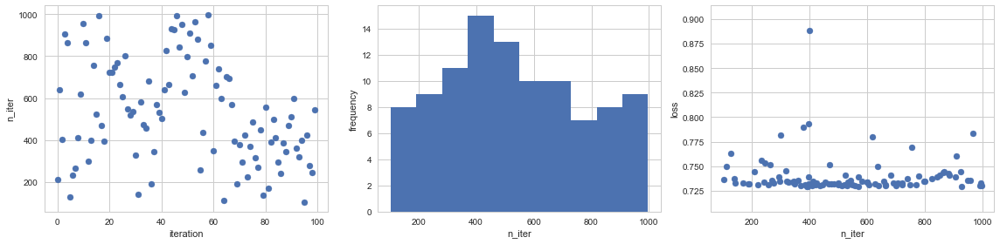
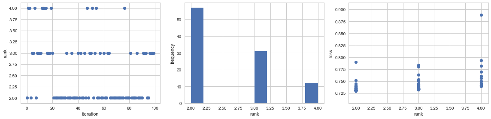

We see above that for ratings only data, little regularization of linear coefficients ought to be applied while significant regularization of second-order coefficients is necessary. Furthermore, it makes sense that given the sparsity of the data, only a rank of 2 is needed, as interactions above the second-order do not exist.

#### Factorization Machine with LSH and Bias Baseline Data
This FM extends the previous FM model by adding the predicted ratings generated from the item-based CF with LSH model and a simple bias model as features in the FM model. This ensembling technique will later be compared with externally blending the outputs of an FM, CF, and bias model rather than feeding the outputs of the CF and bias models into the FM.

Below are the results of a TPE search for optimal hyperparameter values of this FM model.

|Hyperparameter|Description|Optimal Value|
|---|---|---|
|init_stdev|The standard deviation of initialized parameters|0.442|
|l2_reg_V|L2 penalty weight for pairwise coefficients|7.360|
|l2_reg_w|L2 penalty weight for linear coefficients|1.501|
|n_iter|Number of ALS parameter updates|883|
|rank|The rank of the factorization used for the second order interactions|2|

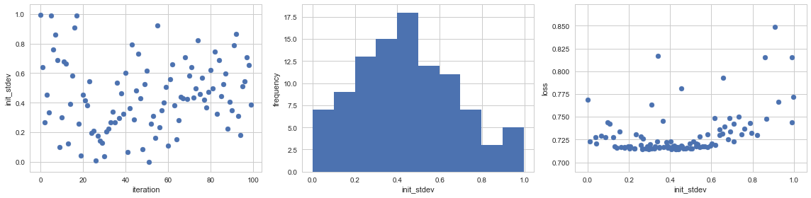
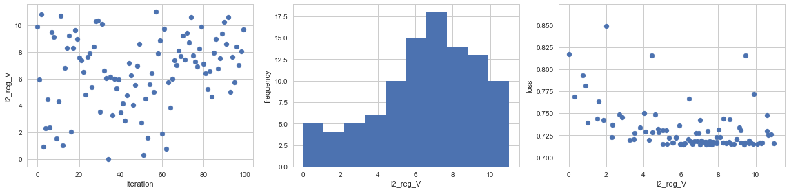
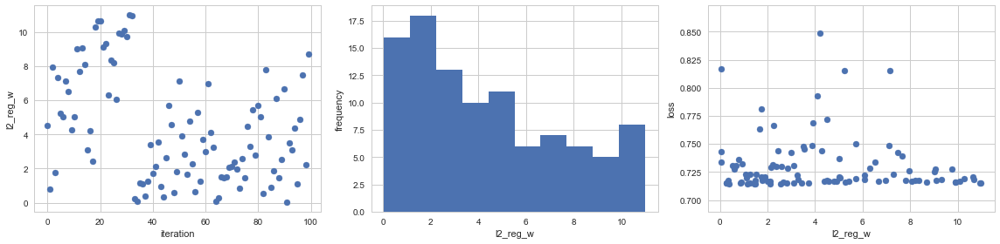
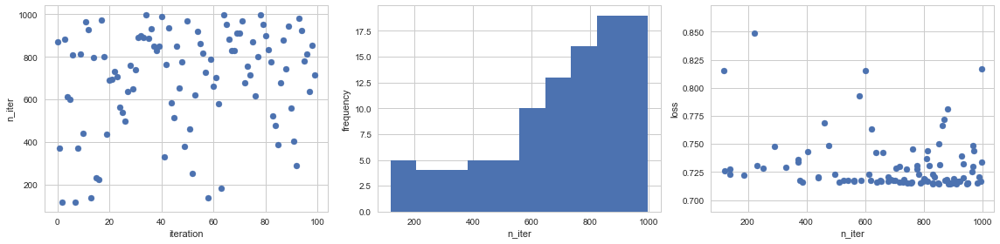
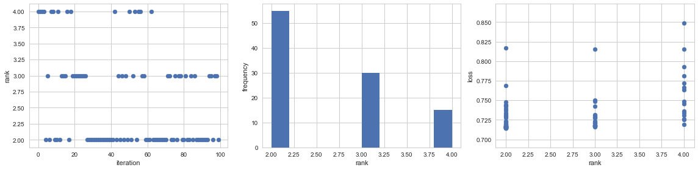

We see above that the optimal hyperparameter values for this FM model are not much different from the previous. However, the regularization of linear coefficients is increased to compensate for the presence of new features on which the model risks overfitting.

#### Factorization Machine with External Data
Because FM's allow the incorporation of additional features beyond what already exists in the Amazon Product Data used for Part I, namely user (reviewerID), item (ASIN - Amazon Standard Identification Number), and rating, we perform web scraping from different online sources in order to collect additional information about each item to feed into the factorization machine. Specifically, we collect new features from the following three sources:

1. Amazon
2. OMDB (The Open Move Database)
3. IMDB (The Internet Movie Database)

For each database, we use their corresponding Python API to collect additional data. We first match items to data in the Amazon database using their ASIN. Because both IMDB and OMDB do not contain ASIN's as features, we use the items' product titles and release years collected from Amazon to search for and retrieve data from IMDB and OMDB. Because the items in our dataset include both TV series and films while IMDB and OMDB focus primarily on film data, approximately 600 items have no corresponding data in IMDB or OMDB. For the sake of consistency when comparing models, we exclude all data involving these 600 items, as described earlier.

Between the three sources of data, the following features are collected and considered for feature engineering:

* **box office**: The amount of revenue a film has earned during its theatrical release.
* **country**: The countries in which the item has been released.
* **language**: The languages in which the item has been released.
* **metascore**: The [metacritic](http://www.metacritic.com/) score for that item (on a scale of 0 to 100).
* **mpaa rating**: The maturity rating of that item (ex: PG, PG-13, R, TV-MA, etc.)
* **runtime**: The total running time of that item.
* **type**: Whether the item is a film or TV series.
* **year**: The year in which the item was released.
* **vfx (visual effect)**: Whether the crew for that item included a visual effects department.
* **imdb genre**: The genres the item belongs to (ex: sci-fi, romance, comedy, etc).
* **imdb studios**: The production studios that created the item. This data is converted into a lemmatized [bag of words](https://en.wikipedia.org/wiki/Bag-of-words_model) model to account for varying studio naming conventions.
* **imdb rating**: The average rating on a scale of 1 to 10 that IMDB users assigned to the item.
* **imdb votes**: The number of IMDB users that rated the item.
* **directors**: The directors for the item.
* **amazon genre**: The primary genre the item belongs to (ex: sci-fi, romance, comedy, etc).
* **actors**: The main actors that appear in the item.
* **amazon studio**: The primary production studio that created the item. This data is similarly converted to a bag of words model.
* **amazon sales rank**: The current sales rank of that item.

In total, **18** features for **6765** items are collected. This data is then merged with the original user-item ratings data, using **ASIN** as the primary key to ensure accurate matching.

Feature engineering is automated as part of the hyperparameter search by treating the decision of whether or not to include a feature in the dataset as a hyperparameter. Below are the results of a TPE search for optimal hyperparameter values of this FM model.

|Hyperparameter|Description|Optimal Value|
|---|---|---|
|n_iter|Number of ALS parameter updates|997|
|init_stdev|The standard deviation of initialized parameters|0.20|
|rank|The rank of the factorization used for the second order interactions|2|
|l2_reg_w|L2 penalty weight for linear coefficients|16.22|
|l2_reg_v|L2 penalty weight for pairwise coefficients|20.97|
|use_actors|Whether to include actors as a feature in the FM model|True|
|use_country|Whether to include country as a feature in the FM model|True|
|use_directors|Whether to include directors as a feature in the FM model|True|
|use_genres|Whether to include genres as a feature in the FM model|False|
|use_language|Whether to include language as a feature in the FM model|True|
|use_mpaa|Whether to include mpaa rating as a feature in the FM model|False|
|use_studios|Whether to include production studios as a feature in the FM model|True|
|use_type|Whether to include item type (movie, episode, series, game) as a feature in the FM model|True|
|use_scores|Whether to include metascore and imdb score as features in the FM model|True|
|use_popularity|Whether to include popularity metrics (imdb votes, Amazon sales rank, and box office) as features in the FM model|True|
|use_year|Whether to include release year as a feature in the FM model|False|
|use_model_results|Whether to include results from LSH and bias baseline models as features in the FM model|True|

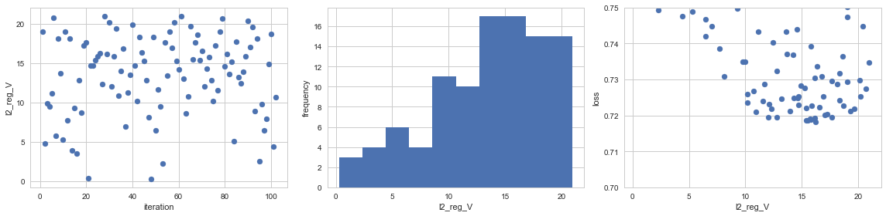
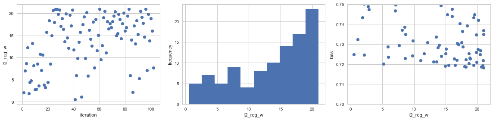
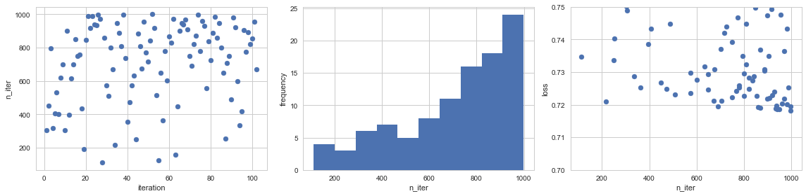
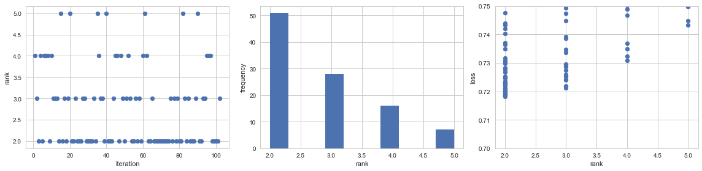
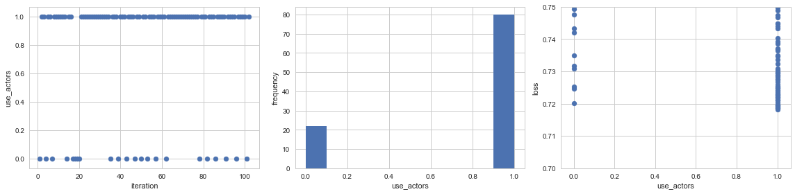
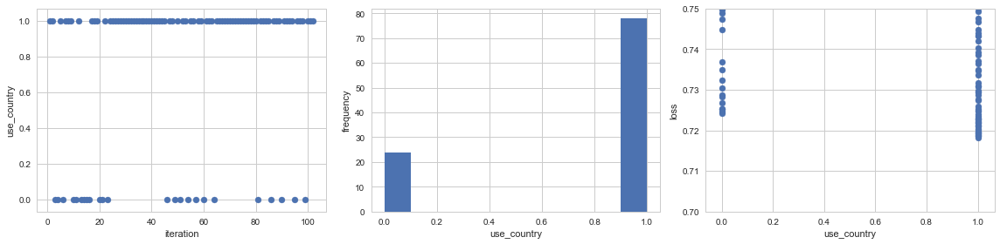

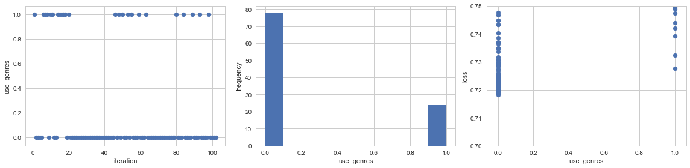
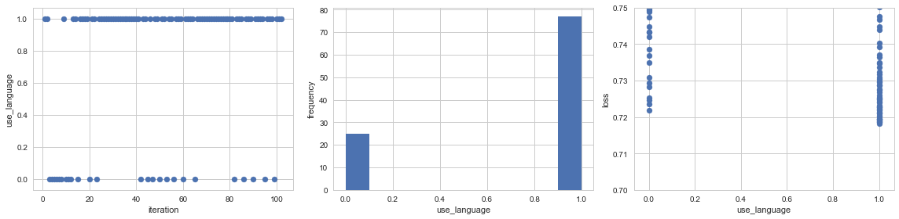
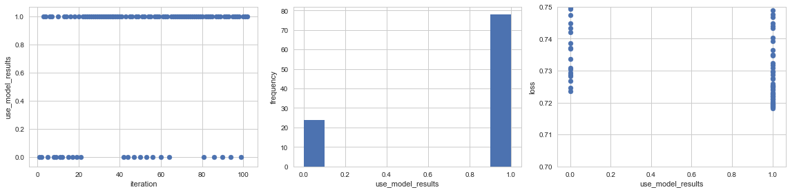
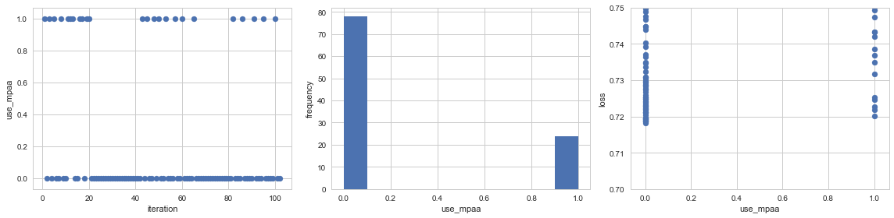
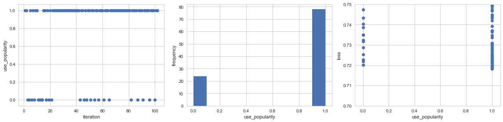

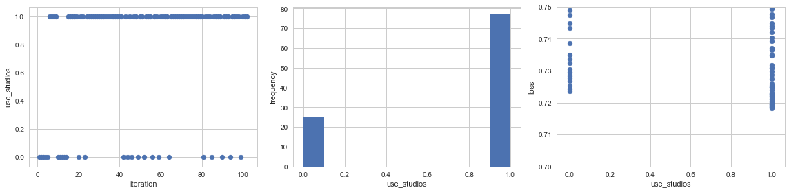
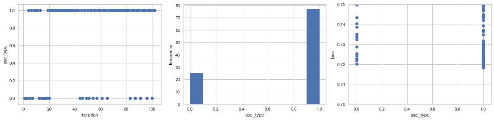

With the exception of genres, release year, and MPAA rating, all other features contribute to the best model the hyperparameter search can find. Interestingly, despite the inclusion of a number of new features, an FM model with a rank of 2 still provides the best results, provided a high degree of regularization is used for both linear and second-order coefficients.

#### Gradient Boosted Tree Ensemble
Whereas the FM with LSH and Bias Baseline model feeds the predicted ratings of the item-based CF model and bias baseline model as features in the FM model, this ensembling method treats the predicted ratings of the ratings-only-FM model, item-based CF model, and bias baseline model as features in a [gradient tree boosting](https://en.wikipedia.org/wiki/Gradient_boosting) model.

Below are the results of a TPE search for optimal hyperparameter values of the GBT ensemble.

|Hyperparameter|Description|Optimal Value|
|---|---|---|
|learning_rate|Rate at which coefficients are updated|0.119|
|max_depth|Maximum tree depth for base learners|1|
|n_estimators|Number of boosted trees to fit|94|
|reg_alpha|L1 regularization term on coefficients|2.710|
|reg_lambda|L2 regularization term on coefficients|1.457|
|subsample|Proportion of training data sampled for each tree|0.429|

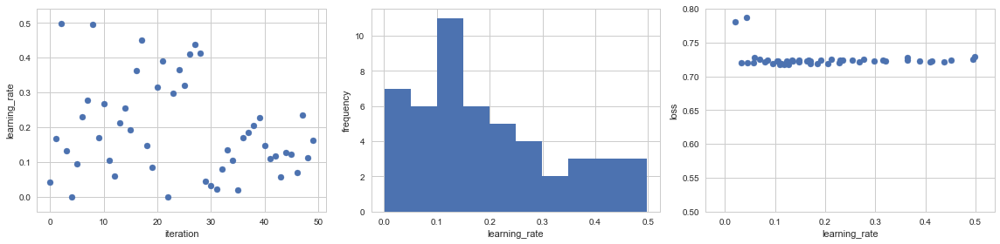
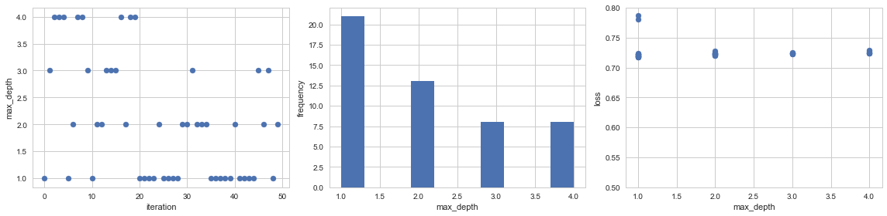
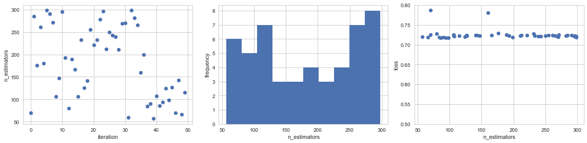
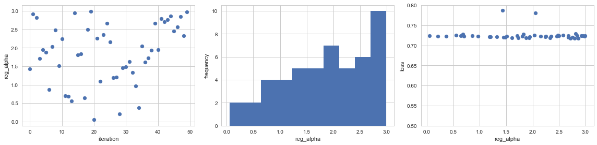
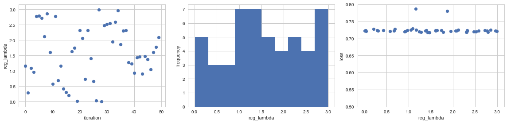
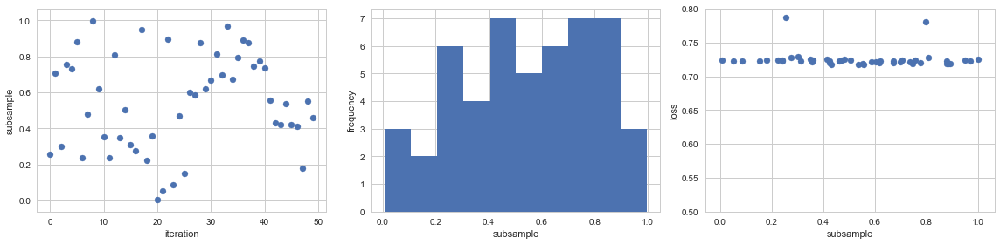

## Results
Below we compare the performance of each optimally tuned model along several metrics. Unless explicitly stated, all results are metrics obtained from evaluating model performance on the test set.

#### Mean Absolute Error
Using the average training set rating as a prediction for all ratings results in a test MAE of 0.94, essentially 1 star. Against this baseline, collaborative filtering with LSH performs noticeably better, with a test MAE of 0.79, or 4/5ths of a star. While such an MAE is not close to that of the best models, it remains acceptable considering that the CF model uses an approximation algorithm for finding nearest neighbors, and so is not expected to be as accurate as a pure collaborative filtering with KNN model.

||Mean Baseline|CF with LSH|Bias Baseline|FM with RatingsOnly|FM with LSH+Bias|FM with ExternalData|GBT Ensemble|
|---|---|---|---|---|---|---|---|
|Train|0.941307|0.776285|0.690115|0.642497|0.645602|0.650397|0.634640|
|CV|0.938894|0.790865|0.725451|0.717786|0.719750|0.709635|0.717471|
|Test|0.941661|0.787686|0.718741|0.712174|0.712980|0.705646|0.711717|

The bias baseline model still performs remarkably well given its computational simplicity, however it is outperformed by all FM models and the GBT ensemble. Among the FM and ensemble models, it is interesting that the FM that uses CF with LSH and bias baseline predictions as input features performs worse than just an FM using only basic ratings data. However, if predictions from the ratings-only FM are ensembled with CF and bias baseline predictions, performance is slightly improved over that of the ratings-only FM.

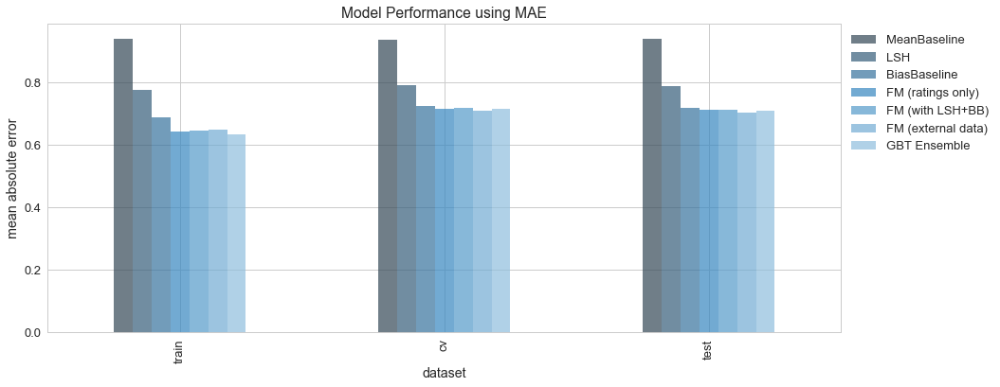

Finally, it appears that incorporating external data into an FM does indeed lead to improved performance, yielding a test MAE of 0.7056, the lowest MAE of both Part I and Part II of this project.

#### Area Under Receiver Operating Characteristic Curve
As stated previously, the AUC score provides a means of assessing the utility of the predicted ratings in discriminating between relevant (rated 4 stars or above) and not relevant items (rated below 4 stars). An AUC score of 0.5 suggests no discriminating power while an AUC score of 1 represents maximum discriminating power. We expect that models with lower test MAE's also have higher AUC scores, and this is largely the case, with the FM model using external data yielding the highest AUC score of 0.827.

||Mean Baseline|CF with LSH|Bias Baseline|FM with RatingsOnly|FM with LSH+Bias|FM with ExternalData|GBT Ensemble|
|---|---|---|---|---|---|---|---|
|Train|0.5|0.771787|0.842967|0.871505|0.871109|0.861593|0.87213|
|CV|0.5|0.762181|0.814528|0.816789|0.816938|0.823384|0.816143|
|Test|0.5|0.767861|0.820651|0.821890|0.822598|0.827128|0.821585|

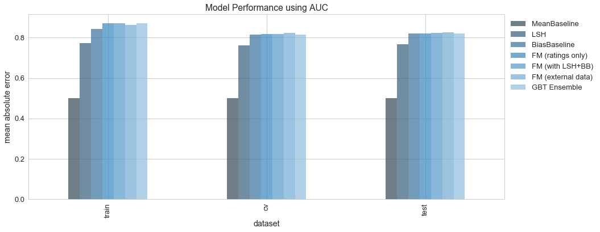

#### ROC and Precision-Recall Curves
The ROC and precision-recall curves for the test performance of each model suggests that the predictions made by the bias baseline, FM models, and ensemble are very similar. That is, while some models within the aforementioned group perform marginally better than others, they tend to make similar mistakes and exhibit the same degrees of tradeoff between precision and recall.

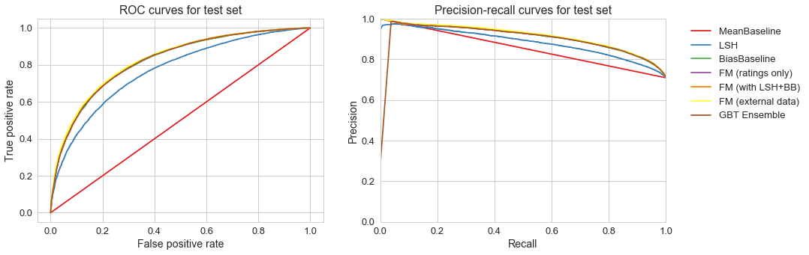

It should be noted that the precision-recall curves are skewed because the data is itself skewed; around 70% of all ratings in the data are 4 stars or above. The precision-recall curve suggests that, using one of the high-performing models, we can attempt to require that 90% of all recommendations are for actually relevant and still recommend around 70% of all actually relevant items. From the perspective of an online retailer looking to surface more of its product catalog, this would be an encouraging result.

#### Performance on prolific users

The hybrid scatter and line plots below visualize how a model's performance changes for users based on how many ratings they have made. Each point of the scatter plot represents a user, defined by how many ratings that user has made and the MAE for that user. The red line delineates the average MAE of all users per ratings count.

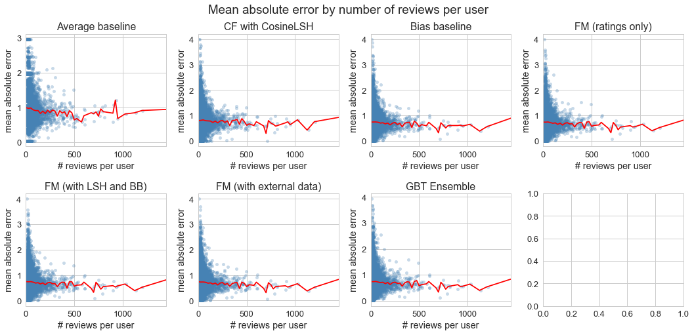

Unsurprisingly, across all models, a common pattern is that the MAE has high variance when the number of reviews per user is low, and converges as the number of reviews increases. However, it appears that, on average, the models do not perform better for more prolific users.

#### Performance on popular items

A similar analysis of how a model's performance changes for items based on how many times it has been rated yields similar results: on average, the models do not perform better for more popular items.

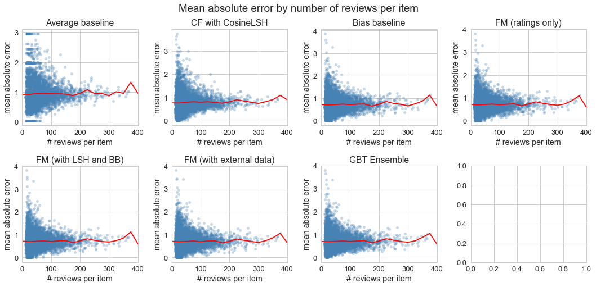

#### Performance by Release Year

Interestingly, starting from 1920, all models (with the exception of the mean baseline) tend to have higher MAE's for items released more recently. The MAE values are quite unstable before the year 1920, presumably due to the scarcity of items of that era in Amazon's catalog.

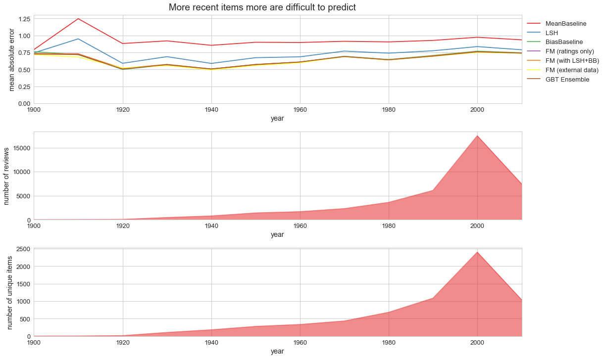

A possible explanation for this trend is that as the number of items in Amazon's catalog increases, the ratings data surrounding these items becomes noisier. Moreover, it may also be the case that people who like "classic" older films have more specific tastes that may be easier to account for.

#### Performance by MPAA Rating

Another surprising finding is that MAE tends to increase for items intended for increasingly mature audiences, with PG-rated films having the lowest MAE and R and NC-17 rated films having the highest. This suggests that more family-friendly entertainment may be easier to predict ratings for.

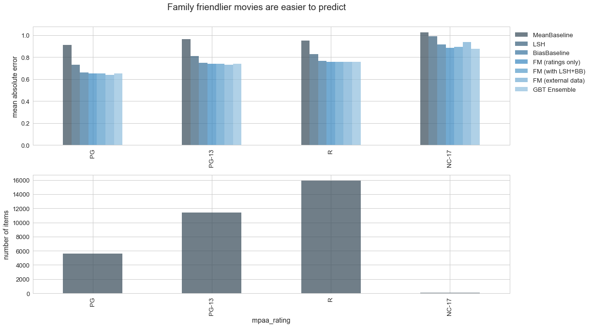

#### Lower Bounds for Catalog and User Coverage

Calculating catalog coverage is a computationally expensive process wherein predictions must be made for all unrated user-item combinations, and the proportion of items that have at least one predicted rating of 4 or above is calculated. Similarly, user coverage can be thought of as the proportion of all users that have at least one predicted rating of 4 or above. Because of limited computational resources, in lieu of calculating exact catalog coverage, we calculate a lower bound by using only predicted ratings for the cross-validation and test sets rather than predicted ratings for the whole universe of user-item pairs. Note that because the average training set rating is 3.9, the mean baseline effectively predicts no items are relevant for any users, resulting in catalog and user coverage of 0.

||Mean Baseline|CF with LSH|Bias Baseline|FM with RatingsOnly|FM with LSH+Bias|FM with ExternalData|GBT Ensemble|
|---|---|---|---|---|---|---|---|
|Catalog coverage|0.0|0.963784|0.856615|0.874945|0.874353|0.874058|0.893570|
|User coverage|0.0|0.700719|0.807672|0.824720|0.824987|0.837240|0.843767|

It should also be noted that user coverage is a less important metric since if a recommendation system cannot predict ratings of 4 or above on any item for a specific user, it can simply recommend the top *k* items with the highest predicted ratings. However, it is still useful to know a lower bound for the proportion of users for which the system can recommend items it believes are relevant.

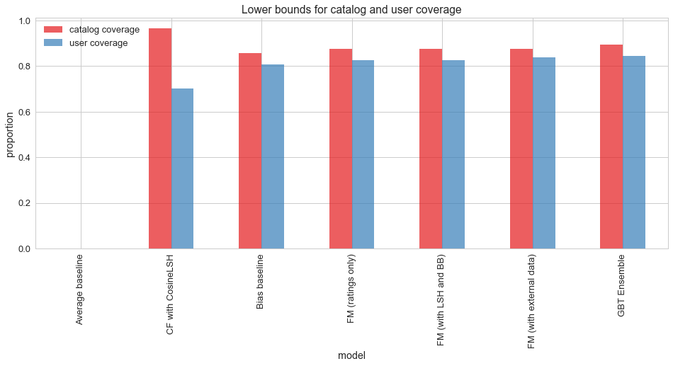

With the exception of the mean baseline, all models have a catalog coverage rate of above 0.8, and with the exception of the mean baseline and CF with LSH, all models have a user coverage of above 0.8 as well. Notably, the GBT ensemble performs best in terms of both catalog and user coverage.

## Conclusion

In Part II of this project, we implemented our own versions of probabilistic latent semantic indexing and collaborative filtering with cosine-based locality sensitive hashing. We then tested the performance of CF with cosine-based LSH, PLSI, FM's with various forms of feature engineering, and ensembling techniques for predicting user-item star ratings in Amazon's film and TV product catalog and compared the performance against common baseline models.

Based on the tests and analyses performed, we observed that all FM models outperform the bias baseline, with the FM model that incorporates scraped external data and predictions from the collaborative filtering and bias baseline model yielding the lowest MAE and highest AUC score. The results show that the incorporation of additional features and predictions from other models into an FM does indeed improve accuracy in predicting whether an item is relevant to a user.

As a practical matter, however, the improvement in performance gained from constructing these additional features does not appear to justify the effort required to collect, process, and tune the data for any setting other than a competitive one (ex: Kaggle). Thus, in a corporate setting, we would recommend the use of an FM using only basic ratings data as it is simple to implement, incredibly fast, and more accurate than other methods.

